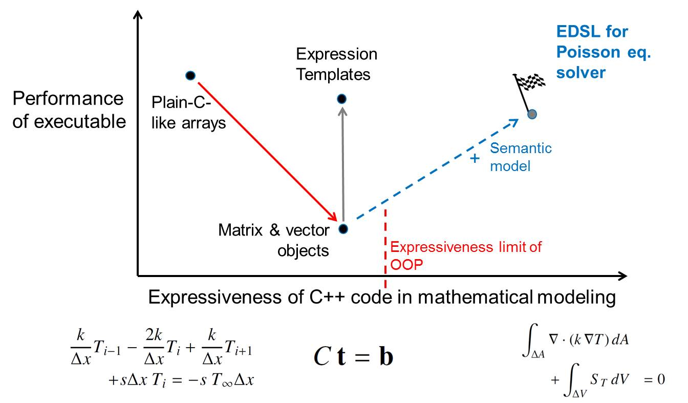
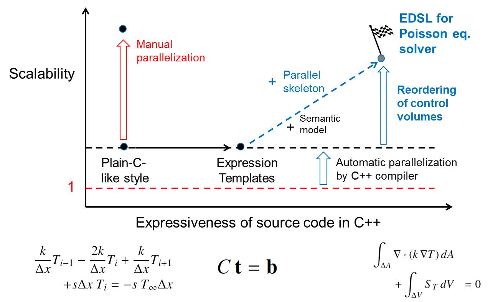

ProtoToPoisson as a Research Project
====================================

Issue
--------------
    
Limit of object-oriented programming (OOP) in C++

* Expressiveness of OOP is not enough for describing a discretization model with finite volume method (FVM). 
* Peformance penalty of OOP style is apparent in matrix and vector operations which are required for solving disretized pertial differential equations (PDEs).

Goal
-------------

To overcoming a limitation of OOP in C++, our EDSL is going to provide semantic model

* transforming the description of a descretization model into plain-C-like code, and 
* parallelizing a matrix solver algorithm based on a user given model.

Contents
--------

.. toctree::
   :maxdepth: 2

    Background <research/background>
    Design and Implementation of our EDSL <research/designImplementation>
    Application Examples <research/applications>
    Benchmarks <research/benchmarks>
    Conclusion and Perspectives <research/conclusion>    

ChangeLog
-------------

Feb. 5. 2016
    Application example 1 was confirmed to work.

