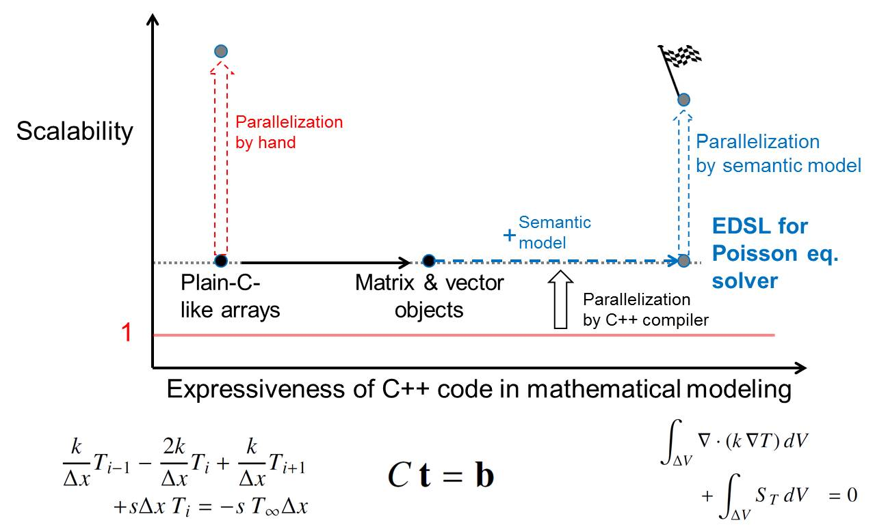

ProtoToPoisson as a Research Project
====================================

Research Issue
    
    Limit of object-oriented programming (OOP) in C++

    * Expressiveness of OOP is not enough for concise description of a discretization model with finite volume method (FVM). 
    * Peformance penalty of OOP style is apparent in matrix and vector operations which are required for solving disretized pertial differential equations (PDEs).

Research Goal

    To overcome a limitation of OOP in C++, our EDSL is going

    * To improve expressiveness of C++ code with the semantic model for FVM, so that you can describe your discretization model in concise code.
    * To transform your expressiveness into parallel scalability with the semantic model for parallelizing a solver algorithm based on your model.

Background
-------------------

Expressiveness or performace ?

Apparently both are necessary, but some scientists have given up one for the other.

    * OOP style code can be expressive for describing a solver algorithm, because it can encapsulate low-level arithmetics into linear-algebra-level obejcts.
    * But such encapsulation sometimes lowers the performace, so that not a few scientist have given up the expressiveness of OOP style to improve the performance.
    * Morever OOP style code in C++ is not so expressive for describing a discretization model, because the semantics of the operators and functions in a modeling method such like FVM is totally different from that in C++.

It was shown that C++ code can be both at least in a solver algorithm.

   * ETs (expression templates) allow one to use matrix and vector objects with no significant performance penalty.

Recent researches are for more expressiveness and performance.

   * Smart ETs for abstracting complex kernels
   * Parallel Skeltons for generating a parallelized program from domain-specific patterns and basic code fragments
   * EDSLs for FEM(finite element method) provide good semantic models, so that one can describe her/his simulation model in concise code.

Our research focus is on expressiveness in a discretization model and parallel scalability.

Design and Implementation of an EDSL
------------------------------------

Features of problem domains

   * Algorithm domain : Linear Algebra

     * Vector and matrix expressions
     * Solving descretized PDEs

   * Model domain : FVM

     * Descretizing PDEs (partial differential equations)
     * This domain is defined with using the algorithm domain.

Front Ends -- Utility classes

    * Grid 

      * Dividing a simulation region into cotrol volumes to descretize continuous data into discrete ones

    * Mathematical operators

      * Such like partial differential and identity operators
      * Necessary to describe Poisson equation

    * Iterative solvers and preconditioners

      * Wrapping linear algebra libraries of third parties 

Back Ends -- Semantic model

   * Transforming differential and identity operators into matrices
   * Transforming spacial functions into vectors
   * Parallelizing serial algorithm with OpenMP and MPI based on a user given model
     
     * Restructuring data structure to distribute simulation data to processors, based on the user specified distribution of the control volumes
     * Reordering indices for matrices and vectors, based on the connectivity of the control volumes
     * Combining parallel skeltons (higher-order functions), basic code fragments, and directives

Application Examples
------------------------------

1. 1D steady state heat conduction

   Cooling of a cylinder by means of convective heat transfer along its length

   * https://github.com/masa-ito/ProtoToPoisson/blob/master/src/test/airCooledCylinder.cpp

   * Its compiled code reproduces the example calculation in a finite volume method textbook, 

     H. K. Versteeg and W. Malalasekera,"An Introduction to Computational Fluid Dynamics, The Finite Volume Method", 2nd Ed. Pearson Educational Limited 1995, 2007, page 125 - 129, example 4.3 .
 

2. 3D steady state heat conduction

   Cooling of a cuboid with internal heat generation

.. math::   k \nabla^2 T(x,y,z) + g | x + y | = 0
.
   where
     * Thermal conductivity : :math:`k`
     * Heat generation rate : :math:`g | x + y |`

   The cuboid size

.. math:: L_x, L_y, L_z
.
   Boundary conditions :

.. math:: \frac{\partial T}{\partial x} = 0 \ \mbox{for} \ x= 0, L_x

.. math:: \frac{\partial T}{\partial y} = 0 \ \mbox{for} \ y = 0, L_y

.. math:: \frac{\partial T}{\partial z} = 0 \ \mbox{for} \ z = 0

.. math:: T(x,y, L_z) = T_c

Benchmarks
----------

* Scalability comparison

   * Refererence program

      * Its hot spot code is rewritten in plain-C style.

   * Manually parallelized program
   * Automatically parallelized program with our EDSL

     * OpenMP
     * MPI

* Hardware architecture comparison

  * PC cluster
  * Fujitsu supercomputer PRIMEHPC FX100

    http://www.fujitsu.com/global/products/computing/servers/supercomputer/primehpc-fx100/

* C++ compiler comparison

  * GNU
  * Intel
  * Fujitsu

ChangeLog
-------------

Feb. 5. 2016
    Sample code 1 was confirmed to work.

